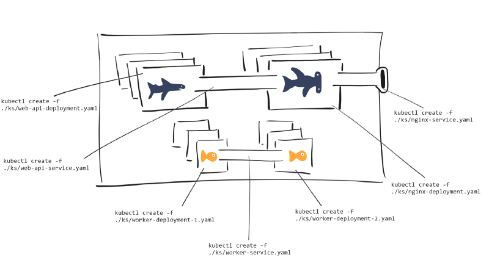

# Deploying Kubernetes applications with Helm

In our [first Kubernetes blog post](https://medium.com/ingeniouslysimple/adopting-kubernetes-step-by-step-f93093c13dfe), we discussed what Kubernetes has to offer and why you might want to use it.

To go with that blog, we started a [series of walk-throughs on github](https://github.com/red-gate/ks) on how to build an application using Kubernetes.

We’ve just released the [latest walk-through](https://github.com/red-gate/ks/blob/master/ks5/ks5.md) in this series, which discusses deploying an application using [Helm](https://github.com/kubernetes/helm). This post is going to talk about why we chose to use Helm. It references the previous walk-throughs in the Kubernetes series, so if you haven’t read them yet it might not make sense. (Click [here](https://github.com/red-gate/ks) to check them out!)

## Motivation

In the first four episodes in our Kubernetes series, we deployed our application using `kubectl`.

This works, but it’s painful because we have to manually run a command **for each** resource in our Kubernetes application. This is prone to error, because we might forget to deploy one resource, or introduce a typo when writing our `kubectl` commands. As we add more parts to our application, the probability of these problems occurring increases.

You could avoid this by writing an automation script, but if you change the filenames or paths of your Kubernetes resources, then you need to update the script too.

The real problem is that **we** have to remember **exactly** how to deploy the application **step by step**. Our “application” (i.e, all of our Kubernetes resources packaged together) is something `kubectl` has no idea about.

```
# Deploying an application to a cluster using kubectl...
> kubectl create -f ./ks/web-api-deployment.yaml
> kubectl create -f ./ks/web-api-service.yaml
> kubectl create -f ./ks/nginx-deployment.yaml
> kubectl create -f ./ks/nginx-service.yaml
> kubectl create -f ./ks/worker-deployment-1.yaml
> kubectl create -f ./ks/worker-deployment-2.yaml
> kubectl create -f ./ks/worker-service.yaml
```

*Note: Although you can point kubectl at a directory, things like rolling back that entire deployment still needs to be managed on a per-resource basis. There’s no model of an entire “application” at this point.*

## Helm to the rescue

Helm offers a solution to this problem. According to the documentation:

> [Helm is a tool for managing Kubernetes charts. Charts are packages of pre-configured Kubernetes resources.](https://github.com/kubernetes/helm#kubernetes-helm)

> [A chart is organized as a collection of files inside of a directory.](https://github.com/kubernetes/helm/blob/master/docs/charts.md#the-chart-file-structure)

In other words, Helm allows us to work from the mental model of managing our “application” on our cluster, instead of individual Kubernetes resources via `kubectl`.

## How does it compare?
Let’s think about how we were deploying using the `kubectl` command line.



Notice how for each resource, we have to run a manual kubectl command?

Compare that to deploying with helm…


We’re able to deploy our **entire application** by pointing helm at a directory containing all of our Kubernetes resources, using one command line call.

## Okay, Helm saves me a few command line calls… so what?

While using helm *does* save you a bunch of command line calls, one of the big wins is that you now get to work from a mental model of managing an **application** on a Kubernetes cluster. You now manage the packaged “release”, instead of each resource on its own.

And helm offers more than that, too.

### Revision management

Helm keeps track of how many times an application has been deployed on a cluster. You can inspect what revision number you’re currently at, and you can even rollback to previous revisions if necessary. Doing this with `kubectl` is possible, but it's much more difficult than just running `helm rollback <APPLICATION> <REVISION_NUMBER>`.

### Updates made easy

If you have changes to your application (e.g a new docker image to deploy), all you have to do is the following after updating your resource files: 

```
helm upgrade <release-name> <chart-directory>
```

Helm does the hard work for you and figures out which bits need to be deployed.

### Templates

If you’ve got a value that multiple deployments need to share (for example a port number), then usually you’d just duplicate that value in each deployment definition.

With Helm, you define configuration values in a separate `values.yaml` file and reference those in other resource files. Helm injects the values at deployment time.

This has the huge benefit of centralising your configuration values. If you update a value, then **all resources** depending on it get that updated value. No more forgetting to update one resource!

## So how do I get started?
You can check out our Kubernetes series on [github.com/red-gate/ks](https://github.com/red-gate/ks).

- [Use helm to deploy an application](https://github.com/red-gate/ks/blob/master/ks5/ks5.md)
- [Create a test environment using helm](https://github.com/red-gate/ks/blob/master/ks6/ks6.md)

You can also read the [helm documentation](https://docs.helm.sh/).

## What’s next?

We’re going to be looking at how we add a database to the cluster. This is interesting because databases are stateful. It’s **not** ok to kill a database pod, because we’ll lose all the data. We need to persist that data outside of the cluster somehow.

Keep an eye out for the next tutorials. We’ll also be looking into database dev-ops practices for how you can manage schema migrations, backups, and other tasks.