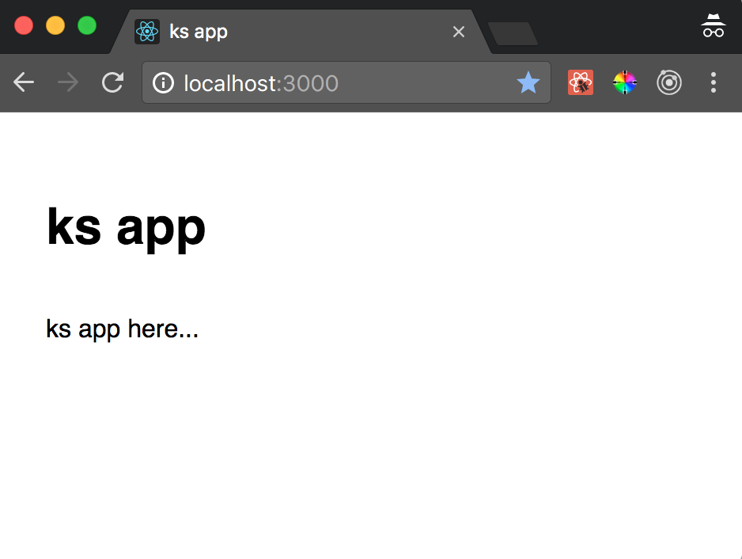

# Kubernetes part 1

Kubernetes series

The objective of this series is to create a web application using kubernetes. We will evolve the application from a development enviroment to a production environment and add different pieces as we go.

## Why Kubernetes

To deploy, scale and manage containerized applications.

* [Why containers](https://kubernetes.io/docs/concepts/overview/what-is-kubernetes/#why-containers)
* [Why do I need Kubernetes and what can it do?](https://kubernetes.io/docs/concepts/overview/what-is-kubernetes/#why-do-i-need-kubernetes-and-what-can-it-do)
* [4 reasons you should use Kubernetes](https://www.infoworld.com/article/3173266/containers/4-reasons-you-should-use-kubernetes.html)

## Evolution of our app

1. build a React app
1. move our react app into kubernetes.
1. build a web server that hosts an API
1. hook frontend and backend together
1. serve website (in a simple case as a webserver with frontend and api)
1. add a database


## Build a React app

* we start with a minimal react application using [create react app](https://github.com/facebookincubator/create-react-app) as our baseline.

1. clone ks repo
    ```bash
    git clone https://github.com/santiaago/ks.git
    ```
1. build app

```bash
➜ ~/dev/github/santiaago/ks/ (master) cd app
➜ ~/dev/github/santiaago/ks/app (master) yarn
    yarn install v1.1.0
    [1/4] 🔍  Resolving packages...
    [2/4] 🚚  Fetching packages...
    [3/4] 🔗  Linking dependencies...
    [4/4] 📃  Building fresh packages...
    success Saved lockfile.
    ✨  Done in 2.92s.
➜ ~/dev/github/santiaago/ks/app (master)  yarn start
    Compiled successfully!

    You can now view app in the browser.

    Local:            http://localhost:3000/
    On Your Network:  http://192.168.0.6:3000/

    Note that the development build is not optimized.
    To create a production build, use yarn build.
```

This should serve your website at `http://localhost:3000/`



## Move app into kubernetes

