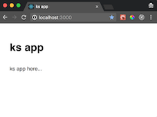

# Kubernetes series part 1

## Build a React app

* we start with a minimal react application using [create react app](https://github.com/facebookincubator/create-react-app) as our baseline.

1. clone ks repo
    ```bash
    git clone https://github.com/santiaago/ks.git
    ```
1. build app

```bash
➜ pwd
    ~/dev/github/santiaago/ks
➜ cd ks1/app
➜ yarn
    yarn install v1.1.0
    [1/4] 🔍  Resolving packages...
    [2/4] 🚚  Fetching packages...
    [3/4] 🔗  Linking dependencies...
    [4/4] 📃  Building fresh packages...
    success Saved lockfile.
    ✨  Done in 2.92s.
➜ yarn start
    Compiled successfully!

    You can now view app in the browser.

    Local:            http://localhost:3000/
    On Your Network:  http://192.168.0.6:3000/

    Note that the development build is not optimized.
    To create a production build, use yarn build.
```

This should serve your website at `http://localhost:3000/`



## Move app into kubernetes

1. start minikube

    ```bash
    ➜ minikube start
    ```

1. switch to minikube context

    ```bash
    ➜ eval $(minikube docker-env)
    ```

    If you ever need to switch back to your machine's context do:

    ```bash
    eval $(docker-machine env -u)
    ```

1. create web Dockerfile

    The web docker image is based on the following docker file:

    ```dockerfile
    FROM node:8.6.0

    ADD ./app /app

    WORKDIR /app

    EXPOSE 3000

    RUN yarn install
    RUN yarn
    CMD ["yarn", "start"]
    ```

1. create the docker image

    ```bash
    docker build -f ./web/Dockerfile -t kswebimage .
    ```

1. create kubernetes deployment file

    File: `dev.ks.deployment.yaml`

    ```yaml
    apiVersion: extensions/v1beta1
    kind: Deployment
    metadata:
    creationTimestamp: null
    labels:
        run: ksweb
    name: ksweb
    spec:
    replicas: 1
    selector:
        matchLabels:
        run: ksweb
    strategy: {}
    template:
        metadata:
        creationTimestamp: null
        labels:
            run: ksweb
        spec:
        containers:
        - image: kswebimage:latest
            name: ksweb
            imagePullPolicy: IfNotPresent
            ports:
            - containerPort: 3000
            resources: {}
    status: {}
    ```

1. create kubernetes service file

    File: `dev.ks.service.yaml`

    ```yaml
    apiVersion: v1
    kind: Service
    metadata:
    creationTimestamp: null
    labels:
        run: ksweb
    name: ksweb
    spec:
    ports:
    - port: 80
        protocol: TCP
        targetPort: 3000
    selector:
        run: ksweb
    type: LoadBalancer
    status:
    loadBalancer: {}
    ```
1. create deployment and service

    ```bash
    ➜ kubectl create -f ./config/dev.ks.deployment.yaml
    deployment "ksweb" created

    ➜ kubectl create -f ./config/dev.ks.service.yaml
    service "ksweb" created
    ```

1. check cluster status

    ```bash
    ➜ kubectl get all
    NAME           DESIRED   CURRENT   UP-TO-DATE   AVAILABLE   AGE
    deploy/ksweb   1         1         1            1           2m

    NAME                  DESIRED   CURRENT   READY     AGE
    rs/ksweb-1832552125   1         1         1         2m

    NAME           DESIRED   CURRENT   UP-TO-DATE   AVAILABLE   AGE
    deploy/ksweb   1         1         1            1           2m

    NAME                        READY     STATUS    RESTARTS   AGE
    po/ksweb-1832552125-6p0z3   1/1       Running   0          2m
    ```

1. check web logs

    ```bash
    ➜ kubectl logs ksweb-1832552125-6p0z3
    yarn run v1.1.0
    $ react-scripts start
    Starting the development server...

    Compiled successfully!

    You can now view app in the browser.

    Local:            http://localhost:3000/
    On Your Network:  http://172.17.0.2:3000/

    Note that the development build is not optimized.
    To create a production build, use yarn build.
    ```

1. service app

    Get URL and navigate to it.
    ```bash
    minikube service ksweb --url
    ```