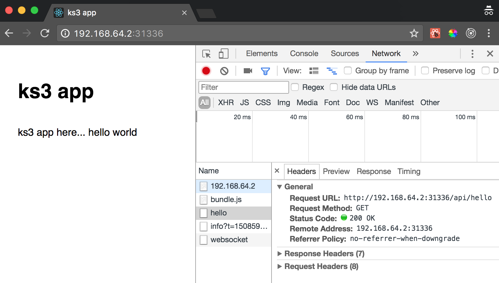

# Kubernetes series part 3

The objective here is to incorporate a python flask server and let our frontend make API calls to it.

1. navigate to ks3

    ```bash
    ➜ pwd
        ~/dev/github/redgate/ks/ks3
    ```

1. start minikube

    ```bash
    ➜ minikube start
    ```

1. switch to minikube context

    ```bash
    ➜ eval $(minikube docker-env)
    ```

    If you ever need to switch back to your machine's context do:

    ```bash
    ➜ eval $(docker-machine env -u)
    ```

1. we create a Flask server

    see `ks/ks3/server` for more details

    `server.py`:

    ```py
    'ks3 web server'

    from flask import Flask

    import controllers.hello as controller_hello

    app = Flask(__name__)

    app.add_url_rule('/api/hello', view_func=controller_hello.hello, methods=['GET'])

    if __name__ == '__main__':
        app.logger.info('starting server in development mode')
        app.logger.info('all ready, starting server')
        app.run(host='0.0.0.0', port=5000)
    ```

    Hello controller `hello.py`:

    ```py
    'hello controller'

    from flask import jsonify
    from flask import current_app

    def hello():
        'GET hello'
        current_app.logger.info('hello controller called')
        return jsonify({
            'message': 'world'
        })
    ```

1. web server dockerfile

    ```dockerfile
    FROM python:3.5

    WORKDIR .

    ADD ./server ./server

    WORKDIR /server

    RUN pip install -r requirements.txt

    ENV FLASK_APP=/server/server.py

    EXPOSE 5000

    ENTRYPOINT ["python"]
    CMD ["server.py"]
    ```

1. build web docker image

    ```bash
    ➜ docker build -f ./web/Dockerfile -t ks3webimage .
    ```

1. build web server docker image

    ```bash
    ➜ docker build -f ./server/Dockerfile -t ks3webserverimage .
    ```

1. we need to update the `dev.ks.deployment.yaml` file with the webserver image `ks3webserverimage`

    ```yaml
    - image: ks3webserverimage:latest
    name: ks3webserver
    imagePullPolicy: IfNotPresent
    command: ["python"]
    args: ["-m", "flask", "run"]
    ports:
    - containerPort: 5000
    resources: {}
    ```

1. mount frontend source code

    In a _separate_ terminal, in the root of the project (this terminal needs to keep running the **whole** time you're debugging...).

    ```bash
    ➜ pwd
        ~/dev/github/redgate/ks/ks3
    ➜ minikube mount ./app/src:/mounted-ks3-app-src
        Mounting ./app/src into /mounted-ks3-app-src on the minikube VM
        This daemon process needs to stay alive for the mount to still be accessible...
        ufs starting
    ```

    For more information about mounting volumes read these [docs](https://github.com/kubernetes/minikube/blob/master/docs/host_folder_mount.md)

1. create deployment and service

    ```bash
    ➜ kubectl create -f ./config/dev.ks.deployment.yaml
        deployment "ks3web" created

    ➜ kubectl create -f ./config/dev.ks.service.yaml
        service "ks3web" created
    ➜ kubectl get all
        NAME            DESIRED   CURRENT   UP-TO-DATE   AVAILABLE   AGE
        deploy/ks3web   1         1         1            1           1m

        NAME                   DESIRED   CURRENT   READY     AGE
        rs/ks3web-1748674206   1         1         1         1m

        NAME            DESIRED   CURRENT   UP-TO-DATE   AVAILABLE   AGE
        deploy/ks3web   1         1         1            1           1m

        NAME                         READY     STATUS    RESTARTS   AGE
        po/ks3web-1748674206-g14vb   2/2       Running   0          1m
    ```

1. get web server logs

    ```bash
    ➜ kubectl logs ks3web-1748674206-g14vb ks3webserver
        * Running on http://127.0.0.1:5000/ (Press CTRL+C to quit)
        * Restarting with stat
        /usr/local/lib/python3.5/runpy.py:125: RuntimeWarning: 'flask.cli' found in sys.modules after import of package 'flask', but prior to execution of 'flask.cli'; this may result in unpredictable behaviour
        warn(RuntimeWarning(msg))
        * Debugger is active!
        * Debugger PIN: 207-014-748
    ```
1. service ks3web

    ```bash
    ➜ minikube service ks3web
    ```

1. we can now call the web server from our frontend code

    * navigate to `./app`
    * we add a proxy to the `./app/package.json` file to `http://localhost:5000`
        `"proxy": "http://localhost:5000"`
    * add fetch api to frontend
        `yarn add whatwg-fetch`

1. delete deployment and docker image

    changes to the package.json are not taken into account when yarn start is running.
    To do that you will have to delete your deployment and recreate your docker image.

    ```bash
    ➜ kubectl delete -f ./config/dev.ks.deployment.yaml
    ➜ docker rmi ks3webimage
    ```

    Then recreate image and deployment.

    ```bash
    ➜ docker build -f ./web/Dockerfile -t ks3webimage .
    ➜ kubectl create -f ./config/dev.ks.deployment.yaml
    ```

1. check app runs as expected

    ```bash
    ➜ kubectl get pods
    ```

1. service app with minikube

    ```bash
    ➜ minikube service ks3web --url
    ```

1. add constructor to app component call `/api/hello` and update a state.

    ```jsx
    class App extends Component {

        constructor(props){
            super(props)
            this.state= { message: 'moon'}
            this.fetchMessage()
        }

        fetchMessage(){
            fetch('/api/hello', {
                headers: {
                    "Content-Type": "application/json"
                }
            }).then(response => {
                return response.json()
            }).then(json => {
                this.setState({message: json.message})
            })
        }

        render() {
            return <div className="App">
                <header className="App-header">
                <h1 className="App-title">ks3 app</h1>
                </header>
                <p className="App-intro">
                ks3 app here...
                hello {this.state.message}
                </p>
            </div>
        }
    }

    export default App
    ```

1. you should get a hello world message

    