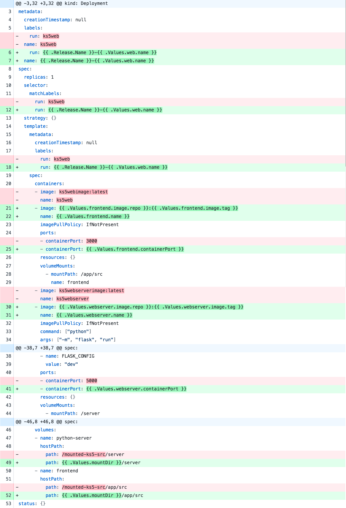
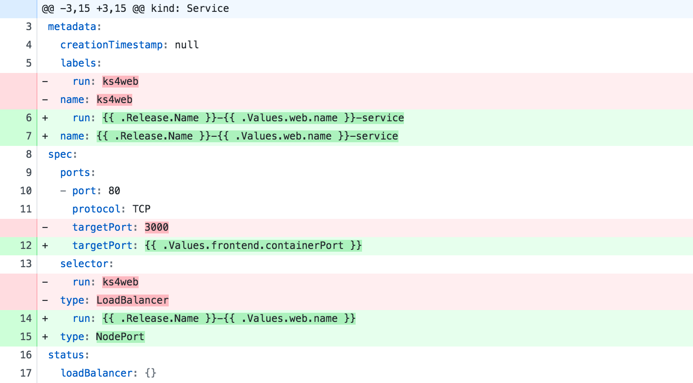

# Kubernetes series part 5

The objective here is to create a Helm "chart" for our Kubernetes application. This will allow us to treat all of our Kubernetes resources as a single package and avoid using `kubectl` to manually deploy individual resources step by step.

Helm also makes it easier to create different environments (dev/test/prod) which we will see the benefit of in later tutorials.

**NOTE: This walk-through is significantly different to previous walk-throughs in the series, as we describe the _process_ of getting to the result you see in the repo. This involves copying previous resources and modifying them to work progressively towards a working solution.**

## Motivation

In all the previous walkthroughs, we deployed our Kubernetes app using the `kubectl` command line application. This was painful because we had to remember to create the _deployment_ and the _service_ each time we wanted to release a new version of our app. If we created any more Kubernetes resources, then we'd have to remember to manually deploy those each time too.

On top of that, we also had to remember the exact file names of our Kubernetes manifest files. If we've built some automation around this, then we'd need to update our scripts each time we made any changes to filenames.

The problem is that _**we**_ have to remember exactly how to deploy the application step by step. Our "application" (i.e, _all_ of our Kubernetes resources packaged together) is something `kubectl` has no idea about.

## Helm

[Helm](https://github.com/kubernetes/helm) is one of the solutions to this problem. According to the documentation:

> [Helm is a tool for managing Kubernetes charts. Charts are packages of pre-configured Kubernetes resources.](https://github.com/kubernetes/helm#kubernetes-helm)

> [A chart is organized as a collection of files inside of a directory.](https://github.com/kubernetes/helm/blob/master/docs/charts.md#the-chart-file-structure)

In other words, Helm allows us to work from the mental model of managing our "application" on our cluster, instead of individual Kubernetes resources via `kubectl`.

One of the other features of Helm is its ability to use _templates_ in Kubernetes resources that are part of the chart. This means you can define values in one place and share them across multiple Kubernetes resource files. We'll also make use of this functonality as part of this walk-through.

## Charting a course to Helm

In this walk-through, we'll turn our Kubernetes application into a helm "chart". This will let us deploy and update our entire application (all of the Kubernetes resources) using a single command line call to helm. We also won't even touch `kubectl` during deployment.

### Getting Helm up and running

Make sure you've got helm installed already. Follow the [Installing Helm](https://docs.helm.sh/using_helm/#installing-helm) documentation to do this.

Once you have Helm installed, the next thing is to initialize the command line and get it running in your cluster.

```bash
➜ helm init
```

To know more about `helm init` see the [documentation](https://github.com/kubernetes/helm/blob/master/docs/helm/helm_init.md).

### Creating the chart

Now that helm is ready we can start changing our `ks4` baseline so that it uses helm.

1. Create the ks5 directory

    ```bash
    ➜ pwd
     ~/dev/github/redgate/ks/
    ➜ mkdir ks5
    ➜ cp -r ./ks4/ ./ks5/
    ➜ cd ks5
    ```

1. Create our new chart

    ```bash
    ➜ pwd
     ~/dev/github/redgate/ks/ks5/

    ➜ helm create ks
    Creating ks
    ```

1. Inspect the chart directory

    ```bash
    ➜ pwd
     ~/dev/github/redgate/ks/ks5/

    ➜ tree ks
    ks
    ├── Chart.yaml
    ├── charts
    ├── templates
    │   ├── NOTES.txt
    │   ├── _helpers.tpl
    │   ├── deployment.yaml
    │   ├── ingress.yaml
    │   └── service.yaml
    └── values.yaml

    2 directories, 7 files
    ```

    Note that helm has created some default Kubernetes resources for us. We want to use our existing resources, so we won't be using the yaml files that have been created for us.

1. Delete the default files

    ```bash
    ➜ pwd
     ~/dev/github/redgate/ks/ks5/

    ➜ rm ks/templates/*.yaml

    # Delete NOTES.txt file
    # The contents of this are shown when you 'install' the chart.
    # But we won't use it in this walk-through
    ➜ rm ks/templates/NOTES.txt

    ➜ tree ks
    ks
    ├── Chart.yaml
    ├── charts
    ├── templates
    │   └── _helpers.tpl
    └── values.yaml

    2 directories, 4 files
    ```

1. Copy our old **development** resources into the helm chart templates directory

    ```bash
    ➜ pwd
     ~/dev/github/redgate/ks/ks5/

    ➜ cp ../ks4/config/dev.* ./ks/templates/

    # Rename to remove the 'dev' prefix
    ➜ mv ./ks/dev.ks.deployment.yaml ./ks/ks.deployment.yaml
    ➜ mv ./ks/dev.ks.service.yaml ./ks/ks.service.yaml

    ➜ tree ks
    ks/
    ├── Chart.yaml
    ├── charts
    ├── templates
    │   ├── _helpers.tpl
    │   ├── ks.deployment.yaml
    │   └── ks.service.yaml
    └── values.yaml

    2 directories, 6 files
    ```

1. Tidy up unneeded resources

    ```bash
    ➜ pwd
     ~/dev/github/redgate/ks/ks5/

    ➜ rm -rf ./config
    ➜ rm -rf ./scripts
    ```

    At this point, we could deploy our helm chart. However, we'll first make use of Helm's _template_ feature.

### Using templates in the chart

Helm creates some values in `values.yaml` that were used in the default resources we just deleted.
We don't want to use any of these values, so we'll define our own. Replace the contents of `values.yaml` with:

```yaml
web:
    name: ks5web

mountDir: /mounted-ks5-src

frontend:
    name: ks5webfrontend
    image:
        repo: ks5webimage
        tag: latest
    containerPort: 3000

webserver:
    name: ks5webserver
    image:
        repo: ks5webserverimage
        tag: latest
    containerPort: 5000
```

We'll now modify our Kubernetes resource files to refer to these values.

### Helm template syntax

First, a quick explanation of the syntax:

`.Release.Name` refers to the name of the _helm release_. This is a string you define when you first deploy your helm chart and stays the same through upgrades.

`.Values.web.name` is a reference to the `name` value under the `web` data structure at the root of our `values.yaml` file.
Whenever you want to refer to a variable in the `values.yaml` file, you must start with `.Values`. You can then pull values out of the data structures you have defined using the dot syntax.

### Updating the resources from `values.yaml`

#### `ks.deployment.yaml`



#### `ks.service.yaml`



## Deploying the chart

At this point, you're ready to deploy the Kubernetes chart.

In one terminal, leave this running:

```bash
➜ pwd
    ~/dev/github/redgate/ks/ks5/
➜ minikube mount .:/mounted-ks5-src
```

In another terminal:

```bash
➜ pwd
    ~/dev/github/redgate/ks/ks5/
➜ cd app
➜ yarn
➜ yarn build
➜ cd ..
➜ eval $(minikube docker-env)
➜ docker build -f ./server/Dockerfile -t ks5webserverimage .
➜ docker build -f ./web/Dockerfile -t ks5webimage .
➜ helm install ./ks/ -n ks

NAME:   ks
LAST DEPLOYED: Thu Jan 11 16:03:29 2018
NAMESPACE: default
STATUS: DEPLOYED

RESOURCES:
==> v1/Service
NAME            TYPE          CLUSTER-IP  EXTERNAL-IP  PORT(S)       AGE
ks5web-service  LoadBalancer  10.0.0.173  <pending>    80:31316/TCP  0s

==> v1beta1/Deployment
NAME    DESIRED  CURRENT  UP-TO-DATE  AVAILABLE  AGE
ks5web  1        1        1           0          0s

==> v1/Pod(related)
NAME                     READY  STATUS             RESTARTS  AGE
ks5web-76588bdd75-r6226  0/2    ContainerCreating  0         0s
```

Your app is now up and running.

## Check everything is up and running

1. get pods

    ```bash
    ➜ kubectl get pods
    NAME                           READY     STATUS    RESTARTS   AGE
    ks-ks5web-5dfd95cc95-9dnn5     2/2       Running   0          7m
    ```

1. service ks5 app

    ```bash
    ➜ minikube service ks-ks5web-service --url
    ```

    Notice the name is now `ks-ks5web-service` previously we were using `ks5web`. This is because we build the service name using helm. More specifically

    `name: {{ .Release.Name }}-{{ .Values.web.name }}-service` in the `ks.service.yaml` file.

1. get web server logs

    ```bash
    ➜ kubectl logs ks-ks5web-5dfd95cc95-9dnn5 ks5webserver
    ➜ kubectl logs ks-ks5web-5dfd95cc95-9dnn5 ks5webfrontend
    ```

## Delete helm release

If you want to delete the application from your cluster, you can do this by using the `helm delete` command:

```bash
➜ helm delete ks
release "ks" deleted
```

Note that this doesn't _completely_ delete the release. You can still see it if you run `helm list --all`

```bash
➜ helm list --all
NAME                    REVISION        UPDATED                         STATUS  CHART                   NAMESPACE
ks                      1               Mon Jan 15 12:56:08 2018        DELETED ks-0.1.0                default
```

You can rollback the delete by using the `helm rollback` command with the listed revision number:

```bash
➜ helm rollback ks 1
Rollback was a success! Happy Helming!
```

This will bring the application back up in your cluster, which you can verify with `kubectl get all`.

If you _really_ want to permanently delete your release, you must use `--purge` when running `helm delete`:

```bash
➜ helm delete --purge ks
release "ks" deleted
```

You won't be able to bring this release back, so you'll need to run another `helm install`.

## What's next

One thing you'll notice is we've only moved our development environment into helm. A next step would be to leverage the `values.yaml` file by offering a configurable "environment" variable. By testing the value of "environment" you can enable or disable parts of the Kubernetes resource configuration file, appropriate to the environment you're deploying to.

In future walk-throughs, we'll be exploring this idea.

We also haven't covered upgrading a release yet. This is possible with `helm` and we'll come to this in another tutorial.