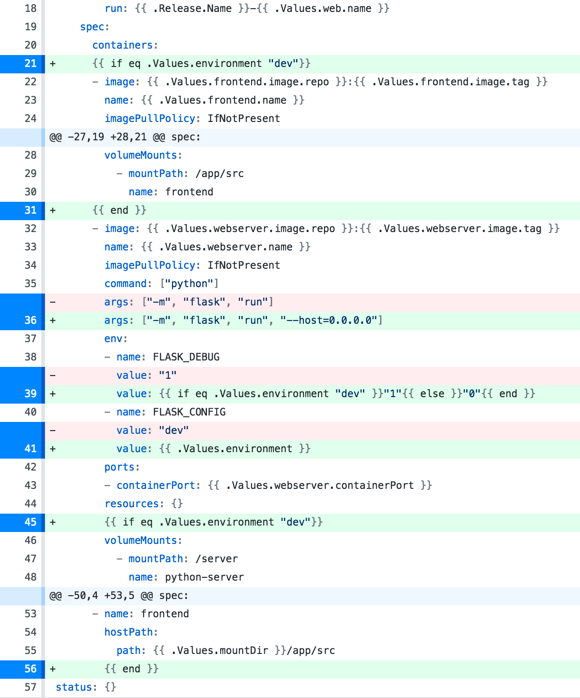
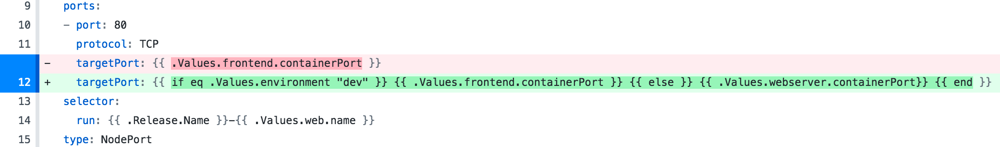

# Kubernetes series part 6

The objective here is to create a **test** environment - that is, build and minimize the frontend code and serve it in our python server as static resources.

To do this, we will leverage `helm`'s template feature to change the Kubernetes configuration based on the value of an `environment` value.

We'll enhance our python server to take the environment into account and serve static files as needed.

This also means we will not use volumes in our **test** environment, only in our **dev** environment.

1. navigate to ks6

    ```bash
    ➜ pwd
        ~/dev/github/redgate/ks/ks6
    ```

1. start minikube

    ```bash
    ➜ minikube start
    ```

1. switch to minikube context

    ```bash
    ➜ eval $(minikube docker-env)
    ```

    If you ever need to switch back to your machine's context do:

    ```bash
    ➜ eval $(docker-machine env -u)
    ```

1. build frontend app

    ```bash
    ➜ cd app
    ➜ yarn
    ➜ yarn build
        yarn run v1.1.0
        $ react-scripts build
        Creating an optimized production build...
        Compiled successfully.

        File sizes after gzip:

        39.7 KB  build/static/js/main.2fba1481.js
        175 B    build/static/css/main.5fcf01d3.css

        ...
        The build folder is ready to be deployed.
        You may serve it with a static server:
        ...
        ✨  Done in 6.36s.
    ```

1. we update the webserver dockerfile to add our built app.

    To add the `app/build` folder when building the image.

    ```dockerfile
    WORKDIR ..

    ADD ./server ./server
    ADD ./app/build ./server/app/build

    WORKDIR /server
    ```

1. update the web server to load a configuration based on the environment

    We need to start using a configuration for our server in order to switch from development mode to production mode.

    ```python
    config_name = getenv('FLASK_CONFIG', 'default')

    if not config_name in config.config:
        raise ValueError('Invalid FLASK_CONFIG "{}", choose one of {}'.format(
            config_name,
            str.join(', ', config.config.keys())))

    app.config.from_object(config.config[config_name])
    config.config[config_name].init_app(app)
    ```

    The config object comes from `./server/config.py` config module. Where we define two environments, a development and a testing environment.

    ```python
    'ks6 config'

    class Config(object):
        'base class for application configuration details.'
        SECRET_KEY = 'ks6'

        @staticmethod
        def init_app(app):
            'init app'
            pass
    class DevelopmentConfig(Config):
        'dev config'
        DEBUG = True
        SERVE_STATIC_FILES = False
        MODE = 'development'

    class TestingConfig(Config):
        'test config'
        DEBUG = False
        SERVE_STATIC_FILES = True
        MODE = 'production'

    config = {
        'dev': DevelopmentConfig,
        'testing': TestingConfig,
        'default': TestingConfig
    }
    ```

1. update the web server to serve our built app as static files.

    To do this we create the Flask app with the `static_folder` argument

    ```python
    app = Flask(__name__, static_folder='./app/build/static/')
    ```

    > static_folder – the folder with static files that should be served at static_url_path. Defaults to the 'static' folder in the root path of the application.

    Finally, we also need to serve static files in the server:

    ```python
    def serve_static_paths(current_app):
        'serve static files if in production mode'

        current_app.logger.info('setting prod static paths')
        if not current_app.config['SERVE_STATIC_FILES']:
            current_app.logger.info('skipping serving static files based on config')
            return
        current_app.logger.info('serving up static files')
        @current_app.route('/', defaults={'path': ''})
        @current_app.route('/<path:path>')
        def serve(path):
            'serve static files'
            if path == '':
                return send_from_directory('./app/build/', 'index.html')
            if exists('./app/build/' + path):
                return send_from_directory('./app/build/', path)
            return send_from_directory('./app/build/', 'index.html')
    ```

    Altogether our server looks like this:

    ```python
    'ks6 web server'

    import logging
    from os import getenv
    from os.path import exists

    import config

    from flask import Flask
    from flask import send_from_directory

    import controllers.hello as controller_hello

    app = Flask(__name__, static_folder='./app/build/static/')
    app.logger.setLevel(logging.DEBUG)
    config_name = getenv('FLASK_CONFIG', 'default')

    if not config_name in config.config:
        raise ValueError('Invalid FLASK_CONFIG "{}", choose one of {}'.format(
            config_name,
            str.join(', ', config.config.keys())))

    app.config.from_object(config.config[config_name])
    config.config[config_name].init_app(app)

    app.add_url_rule('/api/hello', view_func=controller_hello.hello, methods=['GET'])

    def serve_static_paths(current_app):
        'serve static paths if in production mode'

        current_app.logger.info('setting prod static paths')
        if not current_app.config['SERVE_STATIC_FILES']:
            current_app.logger.info('skipping serving static files based on config')
            return
        current_app.logger.info('serving up static files')
        @current_app.route('/', defaults={'path': ''})
        @current_app.route('/<path:path>')
        def serve(path):
            'serve static files'
            if path == '':
                return send_from_directory('./app/build/', 'index.html')
            if exists('./app/build/' + path):
                return send_from_directory('./app/build/', path)
            return send_from_directory('./app/build/', 'index.html')

        current_app.logger.info('all ready, static paths set')

    serve_static_paths(app)

    if __name__ == '__main__':
        app.run(host='0.0.0.0', port=5000)
    ```

1. build web server docker image

    ```bash
    ➜ docker build -f ./server/Dockerfile -t ks6webserverimage .
    ```

1. we add a new value at the top of our `values.yaml` file in the `ks` chart directory.

    ```yaml
    environment: testing
    ```

1. update our `ks.deployment.yaml` to check the new environment value

    

    Notice that we only use the frontend container and volume mounts when `environment === "dev"` is true.

    Also, we pass the value of `Values.environment` through as `FLASK_CONFIG`, so our python server knows which configuration to use.

1. update our `ks.service.yaml` to check the new environment value

    

    Notice that we use the frontend container port _only_ when `environment === "dev"` is true.

1. update the `ks` chart version since we've made a change to the chart configuration itself. Bump the minor version value in `Chart.yaml` to 2:

    ```yaml
    apiVersion: v1
    description: A Helm chart for Kubernetes
    name: ks
    version: 0.2.0
    ```

1. create a release

    ```bash
    helm install ./ks -n ks

    # If you already have a release with this name,
    # then run the following instead to do an upgrade:
    # helm upgrade ks ./ks
    ```

1. service ks-ks6web-service

    ```bash
    ➜ minikube service ks-ks6web-service --url
    ```

1. get web server logs

    ```bash
    ➜ kubectl logs ks-ks6web-57bfbb84db-s2kl5
        * Running on http://0.0.0.0:5000/ (Press CTRL+C to quit)
        172.17.0.1 - - [15/Jan/2018 16:56:21] "GET / HTTP/1.1" 200 -
        172.17.0.1 - - [15/Jan/2018 16:56:21] "GET /static/css/main.5fcf01d3.css HTTP/1.1" 200 -
        172.17.0.1 - - [15/Jan/2018 16:56:21] "GET /static/js/main.2fba1481.js HTTP/1.1" 200 -
        172.17.0.1 - - [15/Jan/2018 16:56:21] "GET /api/hello HTTP/1.1" 200 -
        172.17.0.1 - - [15/Jan/2018 16:56:22] "GET /favicon.ico HTTP/1.1" 200 -
    ```

1. switch to a development environment.

    Clean up the test environment:

    ```bash
    ➜ helm delete --purge ks
    ```
    Run volume

    ```bash
    ➜ pwd
        ~/dev/github/redgate/ks/ks6
    ➜ minikube mount .:/mounted-ks6-src
    ```

    Change `values.yaml` environment to "dev"
    ```yaml
    environment: dev
    ```

    Make sure you have the web frontend image built for the dev environment
    ```bash
    ➜ docker build -f ./web/Dockerfile -t ks6webimage .
    ```

    Create dev release

    ```bash
    ➜ helm install ./ks -n ks
    ```

    Navigate to ks6web url

    ```bash
    ➜ minikube service ks-ks6web-service --url
    ```
