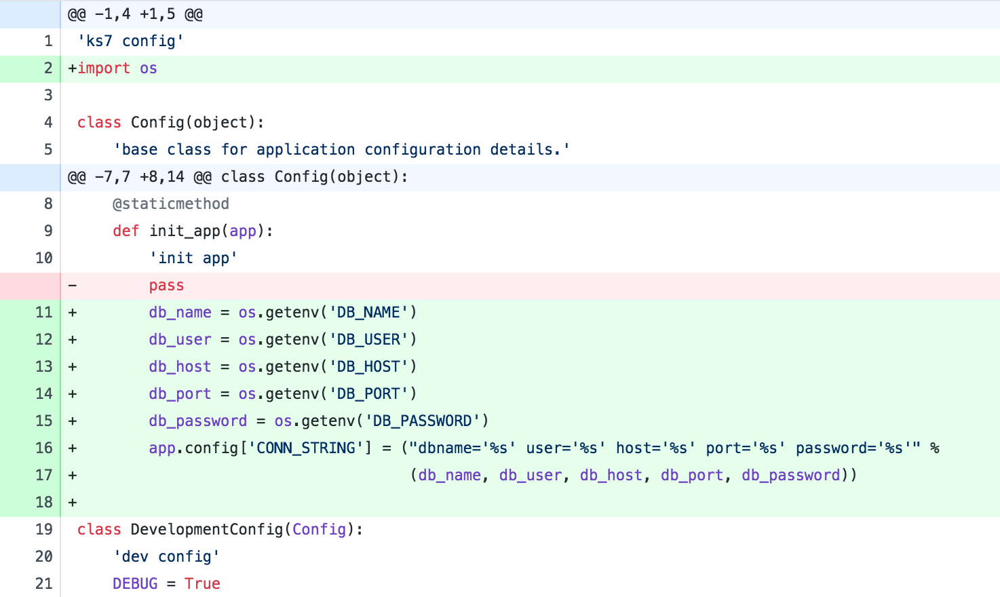
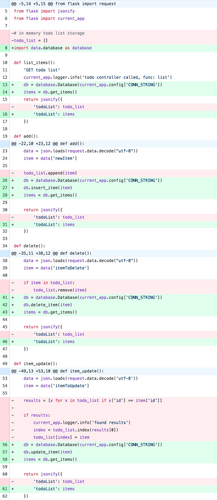

# Kubernetes series part 8-1

The objective here is to remove the in-memory todo list store done in [ks7](../ks7/ks7.md) and instead use a database. We will be using **PostgreSQL** for our database.

In this episode, we'll spin up a pod that runs our database inside our Kubernetes cluster. This will allow us to keep the database defined in the same logical unit as the rest of our application pieces.

However, we'll discover that this is not ideal as the data in PostgreSQL is not persisted if our database pod goes down for any reason. In the next episodes, we'll see how you can tackle this problem.

## Code changes

1. Rename `ks.deployment.yaml` and `ks.service.yaml` so we can differentiate them from our database deployment.

    ```bash
    ➜ pwd
        ~/dev/github/redgate/ks/ks8-1
    ➜ mv ./ks/templates/ks.deployment.yaml ./ks/templates/ks.web.deployment.yaml
    ➜ mv ./ks/templates/ks.service.yaml ./ks/templates/ks.web.service.yaml
    ```

1. Create the some new database configuration values in our helm `Values.yaml`

    Append these values to end of the file:

    ```yaml
    database:
        name: ks8db
        image:
            repo: ks8dbimage
            tag: latest
        containerPort: 5432
        config:
            dbName: ks
            dbUser: redgate
            dbPassword: ""
    ```

1. Create the Kubernetes deployment definition that will be used to spin up a PostgreSQL pod

    We will explain what the environment variables are for shortly.

    ```yaml
    apiVersion: extensions/v1beta1
    kind: Deployment
    metadata:
    labels:
        run: {{ .Release.Name }}-{{ .Values.database.name }}
    name: {{ .Release.Name }}-{{ .Values.database.name }}
    spec:
    replicas: 1
    selector:
        matchLabels:
        run: {{ .Release.Name }}-{{ .Values.database.name }}
    template:
        metadata:
        labels:
            run: {{ .Release.Name }}-{{ .Values.database.name }}
        spec:
        containers:
        - image: {{ .Values.database.image.repo }}:{{ .Values.database.image.tag }}
            name: {{ .Values.database.name }}
            imagePullPolicy: IfNotPresent
            ports:
            - containerPort: {{ .Values.database.containerPort }}
            resources: {}
            env:
            - name: POSTGRES_USER
            value: {{ .Values.database.config.dbUser }}
            - name: POSTGRES_DB
            value: {{ .Values.database.config.dbName }}
            - name: POSTGRES_PASSWORD
            value: {{ .Values.database.config.dbPassword }}
    status: {}
    ```

1. Create the accompanying database service so our python web service can discover and interact with it

    ```yaml
    apiVersion: v1
    kind: Service
    metadata:
    creationTimestamp: null
    labels:
        run: {{ .Release.Name }}-{{ .Values.database.name }}-service
    name: {{ .Release.Name }}-{{ .Values.database.name }}-service
    spec:
    ports:
    - port: {{ .Values.database.containerPort }}
        protocol: TCP
        targetPort: {{ .Values.database.containerPort }}
    selector:
        run: {{ .Release.Name }}-{{ .Values.database.name }}
    type: NodePort
    ```

1. Create a new folder 'database' at the root of the episode folder, and a subfolder called 'sql'

    ```bash
    ➜ pwd
        ~/dev/github/redgate/ks/ks8-1
    ➜ mkdir database
    ➜ mkdir ./database/sql
    ```

1. Create a new sql script with filename `1_create_todo_list.sql` in the sql folder you just created (including the numeric prefix at the beginning)

    ```sql
    CREATE TABLE todo_list(
        id SERIAL PRIMARY KEY,
        task_id TEXT UNIQUE NOT NULL,
        name TEXT NOT NULL,
        done BOOLEAN NOT NULL
    );
    ```

    This creates a `todo_list` table, which will store all of the items entered via the web app.

1. Create a `Dockerfile` in the database folder

    ```Dockerfile
    FROM postgres:9.5

    COPY ./database/sql /docker-entrypoint-initdb.d/
    ```

    Notice that we're basing our container off the official Docker PostgreSQL image, specifically version 9.5

    We also copy all of the sql scripts under the `./database/sql` folder. This takes advantage of a feature in the official PostgreSQL image which allows you to run SQL before the PostgreSQL service is up. From the docs:

    > After the entrypoint calls initdb to create the default postgres user and database, it will run any *.sql files [...] found in that directory [`/docker-entrypoint-initdb.d`] to do further initialization before starting the service.

1. Update the Kubernetes web deployment file to pass through the appropriate environment variables to allow it to interact with the database

    Append these under the existing `FLASK_CONFIG` environment variable

    ```yaml
        - name: DB_NAME
          value: {{ .Values.database.config.dbName }}
        - name: DB_USER
          value: {{ .Values.database.config.dbUser }}
        - name: DB_PORT
          value: "{{ .Values.database.containerPort }}"
        - name: DB_HOST
          value: "{{ .Release.Name }}-{{ .Values.database.name }}-service"
        - name: DB_PASSWORD
          value: {{ .Values.database.config.dbPassword }}
    ```

    We can use these values in the web server configuration to build up a connection string.

1. Add some additional config in the python web server `config.py` file:

    

1. Add another requirement to the python `requirements.txt` file

    ```
    psycopg2==2.7.3.1
    ```

    We'll be using `psycopg2` in our Python web app to interact with the PostgreSQL database

1. Create a `data` folder under `server` folder, and create a `database.py` file with the following code:

    ```python
    'database API'
    import psycopg2

    class Database():

        def __init__(self, conn_string):
            self.connection_string = conn_string

        def __connect(self):
            conn = psycopg2.connect(self.connection_string)
            return conn

        def insert_item(self, item):
            conn = self.__connect()
            cursor = conn.cursor()
            insert_statement = 'INSERT INTO todo_list (task_id, name, done) VALUES (%s, %s, %s)'
            cursor.execute(insert_statement, (item['id'], item['name'], item['done']))
            conn.commit()
            conn.close()

        def get_items(self):
            conn = self.__connect()
            cursor = conn.cursor()
            cursor.execute('SELECT task_id, name, done FROM todo_list ORDER BY task_id ASC')
            results = cursor.fetchall()
            items = []
            for result in results:
                items.append({'id': result[0], 'name': result[1], 'done': result[2]})
            return items

        def update_item(self, item):
            conn = self.__connect()
            cursor = conn.cursor()
            update_statement = 'UPDATE todo_list SET done = %s WHERE task_id = %s'
            cursor.execute(update_statement, (item['done'], item['id']))
            conn.commit()
            conn.close()

        def delete_item(self, item):
            conn = self.__connect()
            cursor = conn.cursor()
            delete_statement = 'DELETE FROM todo_list WHERE task_id = %s'
            cursor.execute(delete_statement, (item['id']))
            cursor.commit()
            conn.close()
    ```
    
    We'll use this class as the API for interacting with the database

1. Update the `todo` controller to take advantage of the new database class

    

## Set up and start ks7

1. start minikube and build docker images

    ```bash
    ➜ cd ks7
    ➜ minikube start
    ➜ eval $(minikube docker-env)

    # Ensure you've built the react app first
    ➜ cd app
    ➜ yarn
    ➜ yarn build
    
    ➜ docker build -f ./server/Dockerfile -t ks8webserverimage .
    ➜ docker build -f ./web/Dockerfile -t ks8webimage .
    ➜ docker build -f ./database/Dockerfile -t ks8dbimage .
    ```

1. mount volume

    ```bash
    ➜ cd ks7
    ➜ minikube mount .:/mounted-ks8-src
    ```

1. install helm chart

    ```bash
    ➜ helm install ./ks -n ks
    ```

1. check app is working properly

    ```bash
    ➜ kubectl get pods
    NAME                         READY     STATUS    RESTARTS   AGE
    ks-ks8db-677bfd85bf-jdv8f    1/1       Running   0          2h
    ks-ks8web-5658c6fd94-8dgvc   2/2       Running   0          1h
    ```

1. check logs

    ```bash
    ➜ kubectl logs ks-ks8web-5658c6fd94-8dgvc ks7webfrontend
    ➜ kubectl logs ks-ks8web-5658c6fd94-8dgvc ks7webserver
    ➜ kubectl logs ks-ks8db-677bfd85bf-jdv8f
    ```

1. test app in browser

    ```bash
    ➜ minikube service ks-ks8web-service
    ```

1. connect to the postgresql server outside of the cluster

    ```bash
    ➜ kubectl get services
    NAME                TYPE        CLUSTER-IP      EXTERNAL-IP   PORT(S)          AGE
    ks-ks8db-service    NodePort    10.102.236.74   <none>        5432:32580/TCP   2h
    ks-ks8web-service   NodePort    10.106.199.60   <none>        80:31899/TCP     2h
    kubernetes          ClusterIP   10.96.0.1       <none>        443/TCP          23h

    # take note of the external cluster port that is open for the database
    # in this case, its 32580

    ➜ minikube status
    minikube: Running
    cluster: Running
    kubectl: Correctly Configured: pointing to minikube-vm at 192.168.64.3

    # take note of the ip address minikube is running on

    # connect via psql command line
    ➜ psql -h 192.168.64.3 -p 32580 -U redgate -w ks
    psql (10.1, server 9.5.10)
    Type "help" for help.

    ks=# \dt
            List of relations
    Schema |   Name    | Type  |  Owner
    --------+-----------+-------+---------
    public | todo_list | table | redgate
    (1 row)

    ks=#
    ```

1. after inserting some data in the webserver, connect to the database as above and query the `todo_list` table

    ```bash
    ks=# select * from todo_list;
    id |    task_id    | name  | done
    ----+---------------+-------+------
    1 | 1516804951842 | one   | f
    2 | 1516804953872 | four  | f
    3 | 1516804952568 | two   | t
    4 | 1516804953344 | three | t
    (4 rows)
    ```

1. now delete the database pod

    ```bash
    ➜ kubectl get pods
    NAME                         READY     STATUS    RESTARTS   AGE
    ks-ks8db-677bfd85bf-jdv8f    1/1       Running   0          2h
    ks-ks8web-5658c6fd94-8dgvc   2/2       Running   0          1h

    ➜ kubectl delete pod ks-ks8db-677bfd85bf-jdv8f
    pod "ks-ks8db-677bfd85bf-jdv8f" deleted
    ```

1. wait for a new database pod to be recreated and connect to it again in the same way as above

    ```bash
    ➜ kubectl get pods
    NAME                         READY     STATUS        RESTARTS   AGE
    ks-ks8db-677bfd85bf-jdv8f    0/1       Terminating   0          2h
    ks-ks8db-677bfd85bf-m7wvv    1/1       Running       0          1h
    ks-ks8web-5658c6fd94-8dgvc   2/2       Running       0          2h

    ➜ psql -h 192.168.64.3 -p 32580 -U redgate -w kspsql (10.1, server 9.5.10)
    psql (10.1, server 9.5.10)
    Type "help" for help.

    ks=# select * from todo_list;
    id | task_id | name | done
    ----+---------+------+------
    (0 rows)

    ks=#
    ```

    Note that we have lost *all of our data*. We need a way to persist this information, as it isn't enough to store it locally in the pod.

    In the next episodes, we'll discuss ways to avoid this problem and persist our data safely.